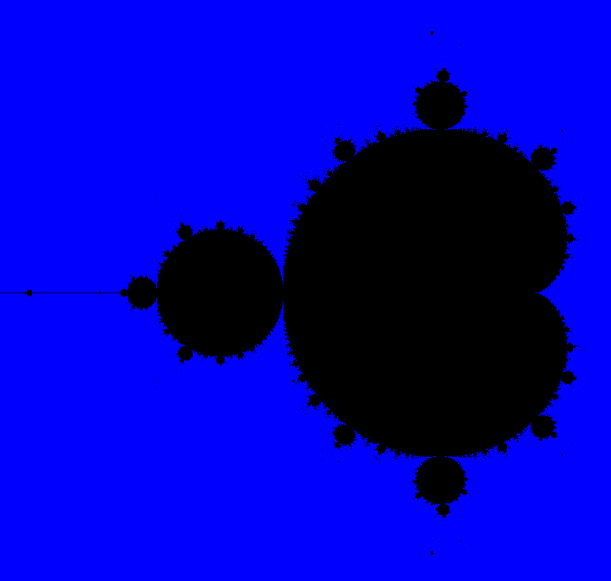

# Mandelbrot set

Simple Mandelbrot set visualization built using SDL3. Nothing fancy,
built mostly as a coding exercise, probably very inefficient.


## Building
Follows https://github.com/libsdl-org/SDL/blob/main/docs/INTRO-cmake.md.

As for dependencises CMake and a C compiler should suffice, for more 
info see the link above.

After cloning the source code, clone the SDL source:
```bash
  git clone https://github.com/libsdl-org/SDL.git vendored/SDL
```
Then configure and build using: 
```bash
cmake -S . -B build
cmake --build build
```

## Screenshot



